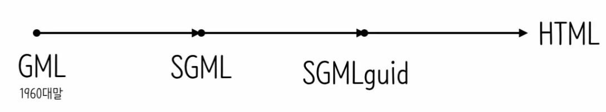

# HTML(HyperText Markup Language)

## 역사

1990년도 팀 버너슬이 제작. 이 전 선행 기술의 영향을 받음.

## 문법

### Tag

태그(<태그>) 속 슬래시(/)유무로 시작과 끝 구별.

| 문법      | 설명                 |
| --------- | -------------------- |
| strong    | 굵은 글씨로 글자강조 |
| h1(h2...) | 제목(heading+숫자)   |
| a         | 링크임을 알려줌      |

### 속성

| 문법                   | 설명                    |
| ---------------------- | ----------------------- |
| href = "링크"          | 링크 걸기               |
| target = "\_blank"     | 새 창으로 열림          |
| title = "어쩌구저쩌구" | 마우스 올리면 문자 출력 |
