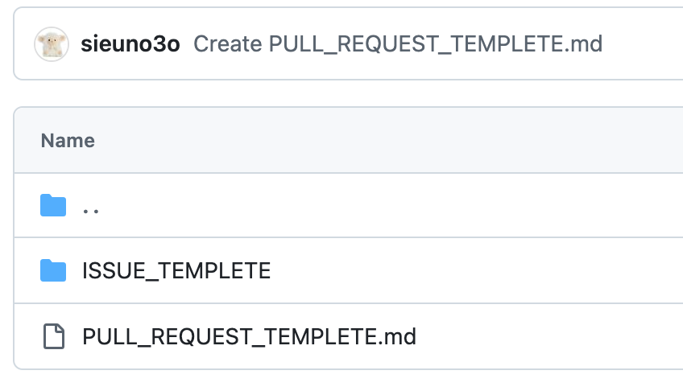

## 사용하는 이유

프로젝트 파일을 복사하거나 압축해서 백업하는 등, 용량 낭비 없이 프로젝트의 내용들을 여러 모드로 자유롭게 전환하고 변경사항들을 쉽게 이동할 수 있음.

## 사용법

| 명령어                         | 설명                                                                              |
| ------------------------------ | --------------------------------------------------------------------------------- |
| **.gitignore**                 | 생성하여 git에 맡기지 않을 파일을 기재                                            |
| **git status**                 | 현재 폴더의 상태을 보여줌                                                         |
| **git diff**                   | status보다 더 구체적으로 변경상황을 보여줌 (j 아래스크롤, k위 스크롤, :q 닫기) |
| **git init**                   | 생성                                                                              |
| **git add**                    | 파일 담기                                                                         |
| **git commit -m "massage"**    | 메시지와 함께 commit 작성하기                                                     |
| **git clone**                  | 불러오기                                                                          |
| **git push(pull) origin main** | push or pull 하기                                                                 |
| **git stash**                  | 헷갈린당...,                                                                      |

[마크다운 명령어](https://gist.github.com/ihoneymon/652be052a0727ad59601)

&nbsp;

# Wap git 세미나
## gitignore 
gitignore 안에 숨길 파일 이름을 적는거임... (ex) .env
- 불필요 파일 제외
- 코드 정리
- 저장소 용량 절약
- api 키 탈취 당하지 않게;;
## .github
.github 안에 탬플릿을 적는거야 ;; ㄷㄷ   
</img>