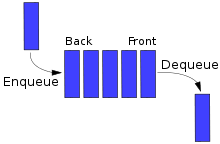

# 자료구조

## 01 자료구조의 이해

### 자료구조의 개념

- 자료구조: 데이터의 특징을 고려하여 저장하는 방법

### 파이썬에서의 자료구조

| 자료구조명       | 특징                                                                |
| ---------------- | ------------------------------------------------------------------- |
| stack            | last in first out                                                   |
| queue            | first in first out                                                  |
| tuple            | 리스트와 같지만 데이터 변경 불가                                    |
| set              | 데이터 중복 x, 수학의 집합연산 지원                                 |
| dictionary       | 전화번호부와 같이 key값과 value값의 형태로 저장. 키 값은 중복 불가  |
| collections 모듈 | 위 자료구조들을 효율적으로 사용할 수 있게 지원하는 파이썬 내장 모듈 |

<br>

## 02 스택과 큐

### 스택

- 스택: Last In First Out (LIFO), 마지막에 들어간 데이터가 가장 먼저 나오는 형태


- 스택에 데이터를 저장하는 것 `push`, 데이터를 추출하는 것 `pop`
- 파이썬에서는 리스트를 사용하여 스택 구현

```py
>>> a = [1, 2, 3, 4, 5]
>>> a.append(10)
>>> a
[1, 2, 3, 4, 5, 10]
>>> a.pop()
10
>>> a
[1, 2, 3, 4, 5]
```

## 큐

- 큐: First In First Out, 먼저 들어간 데이터가 먼저 나오는 형태



```py
>>> a = [1, 2, 3, 4, 5]
>>> a.append(10)
>>> a.pop(0)
1
>>> a.pop(0)
2
>>> a
[3, 4, 5, 10]
```

<br>

## 03 튜플과 세트

### 튜플

- 리스트와 같은 개념, 값 변경 불가능

```py
>>> t = (1, 2, 3)
>>> print (t + t, t * 2)
(1, 2, 3, 1, 2, 3) (1, 2, 3, 1, 2, 3)
>>> len(t)
3

# 값 변경 불가능
>>> t[1] = 5
# error
```

### 세트

- 값을 순서 없이 저장하되 중복을 불허

```py
>>> s =  set([1, 2, 3, 1, 2, 3])
>>> s
{1, 2, 3}
```

```py
>>> s
{1, 2, 3}

>>> s.add(1) # 원소 하나 추가
>>> s # 추가했지만 중복된 데이터라 추가되지 x
{1, 2, 3}

>>> s.remove(1) # 원소 하나 제거
>>> s
{2, 3}

>>> s.update([1, 4, 5, 6, 7]) # 새로운 리스트를 그대로 추가
>>> s
{1, 2, 3, 4, 5, 6, 7}

>>> s.discard(3) # 원소 하나 제거
>>> s
{1, 2, 4, 5, 6, 7}

>>> s.clear() # 모든 원소 삭제
>>> s
set()
```

- 세트를 사용한 파이썬의 집합연산

```py
>>> s1 = set([1, 2, 3, 4, 5])
>>> s2 = set([3, 4, 5, 6, 7])

>>> s1.union(s2) # 합집합
>>> s1 | s2
{1, 2, 3, 4, 5, 6, 7}

>>> s1.intersection(s2) # 교집합
>>> s1 & s2
{3, 4, 5}

>>> s1.difference(s2) # 차집합
>>> s1 - s2
{1, 2}
```

<br>

## 04 딕셔너리

### 딕셔너리의 개념

- 데이터의 유일한 구분자인 `key`라는 이름으로 검색할 수 있게 하고, 실제 데이터를 `value`라는 이름과 쌍으로 저장하여 데이터를 쉽게 찾을 수 있도록 함.
- ex) 학번을 key로, 이름 생년월일 주소를 리스트 형태로...

### 파이썬에서의 딕셔너리

- 파이썬에서의 딕셔너리 선언

```
딕셔너리 변수 = {키 1: 값 1, 키 2: 값 2, 키 3: 값 3, ...}
```

- 다양한 자료형 포함 가능
  - 이름은 문자열로 저장 후 리스트와 같이 한번에 데이터를 입력하거나 튜플, 세트, 딕셔너리 같은 데이터 사용 가능.

```py
>>> student_info = {20140012:'Sungchul', 20140059:'Jiyong', 20140058:'Jaehong'}
>>> stuendt_info[20140012]
'Sungchul'

>>> stuendt_info[20140012] = 'Sungchul' # 재할당
>>> stuendt_info[20140012]
'Sungchul'

>>> stuendt_info[20140039] = 'Wonchul' # 데이터 추가
>>> stuendt_info
{20140012:'Sungchul', 20140059:'Jiyong', 20140058:'Jaehong', 20140039:'Wonchul'}
```

### 딕셔너리 함수

```py
>>> country_code = {} # 딕셔너리 생성
>>> country_code = {"America":1, "Korea":2, "China":86, "Japan":81}
>>> country_code
{'America':1, 'Korea':2, 'China':86, 'Japan':81}

>>> country_code.keys() # 키만 출력
dict_keys(['America', 'Korea', 'China', 'Japan'])

>>> country_code.values() # 값만 출력
dict_values([1, 82, 86, 81])

>>> country_code.items()
dict_items([('America', 1), ('Korea', 2), ('China', 86), ('Japan', 81)])
```

- 딕셔너리 출력 시 for문과 함께 많이 사용

```py
for k, v in country_code.items():
    print("Key: ", k)
    print("Value: ", v)
```

    Key: America
    Value: 1
    Key: Korea
    Value: 2
    Key: China
    Value: 86
    Key: Japan
    Value: 81

- 딕셔너리 사용 방법 중 하나 `if문` 사용 특정 키나 값이 포함됐는지 확인

```py
>>> "Korea" in country_code.keys()
True
>>> 82 in country_code.values()
True
```

<br>

## 05 collections 모듈

- 리스트, 튜플, 딕셔너리 등을 확장하여 제작된 파이썬 내장 모듈

### deque 모듈

- stack, queue를 모두 지원하는 모듈
- 리스트와 비슷한 형식으로 데이터 저장

```py
>>> from collections import deque
>>>
>>> deque_list = deque()
>>> for i in range(5):
>>>     deque_list.append(i)
>>>
>>> print(deque_list)

deque([0, 1, 2, 3, 4])
```

- `pop()` 이용하여 stack 처럼 나중에 넣은 값부터 하나씩 추출

```py
>>> deque_list.pop()
4
>>> deque_list.pop()
3
>>> deque_list.pop()
2
>>> deque_list

deque([0, 1])
```

- `pop(0)`으로 queue **사용 불가능**, `appendleft()` 함수 사용!

```py
>>> from collections import deque
>>>
>>> deque_list = deque()
>>> for i in range(5):
>>>     deque_list.appendleft(i)
>>>
>>> print(deque_list)

deque([4, 3, 2, 1, 0])
```

- deque는 연결 리스트(linked list)의 특성을 지원함.
  - 다음 요소의 주소값을 저장하여 데이터를 원형으로 저장
  - 마지막 요소에 첫번째 값의 주소 저장  
    -> 해당 값을 찾아갈 수 있도록 연결시켜줌
- 해당 특성으로 인한 `rotate()` 함수 사용 가능

```py
>>> from collections import deque
>>>
>>> deque_list = deque()
>>> for i in range(5):
>>>     deque_list.append(i)

>>> print(deque_list)
deque([0, 1, 2, 3, 4])

>>> deque_list.rotate(2) # 값이 2칸씩 이동
>>> print(deque_list)
deque([3, 4, 0, 1, 2])

>>> deque_list.rotate(2)
>>> print(deque_list)
deque([1, 2, 3, 4, 0])
```

- `reversed()` 사용하여 기존과 반대로 데이터 저장 가능

```py
>>> deque_list.reversed()
>>> print(deque_list)
deque([0, 4, 3, 2, 1])
```

- 리스트에서 지원하는 함수도 사용할 수 있음
  - `extend()`, `extendleft()` 함수 이용하여 리스트 통째로 추가

```py
>>> deque_list.extend([5, 6, 7])
>>> print(deque_list)
deque([1, 2, 3, 4, 0, 5, 6, 7])

>>> deque_list.extendleft([5, 6, 7])
>>> print(deque_list)
deque([7, 6, 5, 1, 2, 3, 4, 0, 5, 6, 7])
```

### OrderedDick 모듈

- 순서를 가진 딕셔너리 객체
- 저장 한 순서대로 결과가 화면에 출력됨
  - 기존 딕셔너리는 저장한 순서와 상관없이 다양한 형태로 출력됨

```py
from collections import OrderedDict

d = OrderedDict()
d['x'] = 100
d['y'] = 200
d['z'] = 300
d['l'] = 500

for k, v in d.items():
    print(k, v)
```

    x 100
    y 200
    z 300
    l 500

- 기존 딕셔너리 변수를 리스트로 추출, `sorted()` 이용하여 키를 기준으로 정렬한 후, 다시 OrderedDick 모듈로 감싸주는(wrapping) 방식으로도 사용 가능
  - 기존 딕셔너리나 리스트의 순서를 지키면서 딕셔너리 형태로 관리할 수 있음!

```py
def sort_by_key(t):
    return t[0]
    # 값을 기준으로 정렬하고 싶다면 t[1]로 변경

from collections import OrderedDict

d = dict()
d['X'] = 100
d['y'] = 200
d['z'] = 300
d['l']= 500

# sort_by_key를 기준으로 d.items() 키, 값을 튜플의 리스트로 정렬
for k, v in OrderedDict(sorted(d.items(), key=sort_by_key)).items():
    print (k, v)
```

    l 500
    x 100
    y 200
    z 300

- Python 3.7부터는 일반 딕셔너리도 삽입 순서를 유지한다고 합니다,,

### defaultdict 모듈

- 딕셔너리 변수 생성 시 키에 기본값 지정
- 새로운 키 생성시 별다른 조치 없이 새로운 값 생성 가능

```py
from collections import defaultdict

d = defaultdict (lambda: 0) # default 값을 0으로 설정
print(d["first"])
```

    0

- 아래 코드에서는 변수 d가 defaultdict 타입으로 선언하면서 초깃값을 리스트로 선언됨.
- 이로인해 새로운 키 값이 없더라도 별도로 오류가 발생하지 않음. 일반적인 dict에 비해 코드수를 줄일 수 있는 큰 장점을 가짐!

```py
from collections import defaultdict

s = [('yellow', 1), ('blue', 2), ('yellow', 3), ('blue', 4), ('red', 1)]
d = defaultdict(list)
for k, v in s:
    d[k].append(v)

print(d.items())
[('blue', [2, 4]), ('red', [1]), ('yellow', [1, 3])]
```

    dict_items([('yellow', [1, 3]), ('blue', [2, 4]), ('red', [1])])

### Counter 모듈

- 시퀀스 자료형의 데이터 값의 개수를 딕셔너리 형태로 반환하는 방법
- 리스트나 문자열과 같은 시퀀드 자료형에 저장된 요소 중에서 같은 값이 몇 개 있는지 그 개수를 반환함

```py
>>> from collections import Counter

>>> text = list("gallahad")
>>> text
['g', 'a', 'l', 'l', 'a', 'h', 'a', 'd']

>> c = Counter (text)
>> с
Counter ({'a': 3, 'l': 2, 'g': 1, 'h': 1, 'd': 17})

>>> c["a"] # 특정 텍스트의 개수 출력 가능
3
```

- 시퀀스 자료형의 데이터를 세는 역할도 하지만, 딕셔너리 형태나 키워드 형태의 매개변수를 이용하여 Counter를 생성할 수 있음

```py
# 딕셔너리 형태로 Counter 객체 생성 방법
>>> from collections import Counter

>>> C = Counter ({'red': 4, 'blue': 2})
>>> print(c)
Counter ({'red': 4, 'blue': 2})
>>> print(list(c.elements()))
['red', 'red', 'red', 'red', 'blue', 'blue']
```

```py
# 키워드 형태의 매개변수를 사용하여 Counter 생성
# 매개변수의 이름 key, 실제 값 value로 함
>>> from collections import Counter

>>> c = Counter(cats = 4, dogs = 8)
>>> print(c)
Counter ({'dogs': 8, 'cats': 4})
>>> print(list(c.elements()))
['cats', 'cats', 'cats', 'cats', 'dogs', 'dogs', 'dogs', 'dogs', 'dogs', 'dogs', 'dogs', 'dogs']
```

- 이 외에도 Counter는 기본 사칙원산, OR, AND, 집합연산 등을 지원함

### namedtuple 모듈

- 튜플 형태로 데이터 구조체를 저장하는 방법

```py
>>> from collections import namedtuple

>>> Point = namedtuple('Point'. ['x', 'y'])
>>> p = Point(11, y=22)
>>> p
Point(x=11, y=22)
>>> p.x, p.y # 값을 불러냄
(11, 22
>>> print(p[0] + p[1]) # 인덱스에는 이름이 들어간 순서대로 값이 저장됨
```
